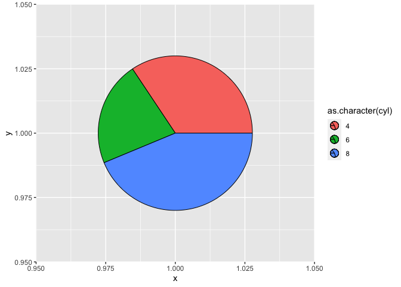
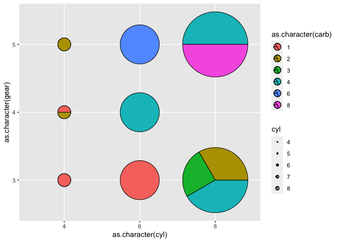

<!-- README.md is generated from README.qmd. Please edit that file -->

# ggpointpie

<!-- badges: start -->
<!-- badges: end -->

## Overview

`ggpointpie` is a [ggplot2](https://ggplot2.tidyverse.org/index.html)
extension that add a new geom that represents a pie chart. You can make
multiple piechart in the same figure, each at different location. Like
[`geom_point()`](https://ggplot2.tidyverse.org/reference/geom_point.html),
[geom_point_pie()](reference/point_pie.html) enables custom aes mapping
of **color**, **fill**, **alpha**, **linetype**, **size**, and more, so
you can make whatever you want.

## Installation

You can install the ggpointpie from github:

``` r
devtool::install("myuhao/ggpointpie")
```

## Example

#### A simple pie chart.

``` r
library(tidyverse)
mtcars %>%
  ggplot(aes(x = 1, y = 1)) +
  ggpointpie::geom_point_pie(aes(fill = as.character(cyl)))
```



#### More complex example

Here, we show the proportion of `carb` in each `cyl` and `gear`
combination. We can map the size of the pie char to `cyl` as well.

``` r
mtcars %>%
  ggplot(aes(x = as.character(cyl), y = as.character(gear))) +
  ggpointpie::geom_point_pie(aes(fill = as.character(carb), r1 = cyl)) +
  ggpointpie::scale_r1_continuous(range = c(0.03, 0.15))
```



## More

Please see the vignette for complete use guide.
